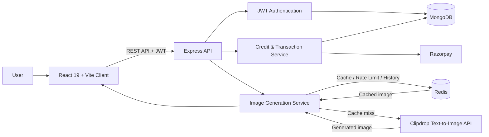

<div align="center">
  <h1>🎨 ImagiFy</h1>
  <p><strong>An AI-Powered Text-to-Image SaaS Platform</strong></p>
  <p>Text-to-Image Generation • Secure Credits & Payments • Redis-Powered Performance</p>

  <p>
    <a href="https://github.com/Nihalani2004/Imagify-AI-Saas/actions/workflows/ci.yml">
      
    </a>
    
    
    
    
    
  </p>
</div>

---

ImagiFy converts natural-language prompts into AI-generated images through the Clipdrop API. It combines secure authentication, credit-based usage, Razorpay payments, Redis-backed caching and rate limiting, and a personal generation-history dashboard into a complete MERN SaaS workflow.

## Highlights

- **87% faster repeat requests** through Redis-backed normalized-prompt caching.
- **Zero additional credits on cache hits** because identical prompts reuse the stored result instead of calling the AI provider again.
- **10 successful generations per user per hour** enforced through an atomic Redis-backed rate-limit reservation.
- **30-day personal history** retaining each user's latest 10 generated images.
- **Secure credit purchases** using Razorpay order creation and server-side HMAC-SHA256 signature verification.

## High-Level Architecture



## Core Features

### AI image generation

- Generates images from descriptive text prompts using the Clipdrop Text-to-Image API.
- Displays generation progress and lets users download generated PNGs.
- Deducts one credit only when a new provider generation is required.

### Authentication and user state

- Email/password registration and login with bcrypt password hashing.
- JWT-protected API routes for credits, image generation, history, and payments.
- React Context API manages user identity, token, and live credit balance across the client.

### Credit-based monetization

- New accounts receive **5 starter credits**.
- A new AI generation costs **1 credit**; cache hits cost **0 credits**.
- Razorpay checkout creates payment orders and verifies HMAC-SHA256 signatures server-side before crediting an account.

### Redis performance and protection

| Capability | Implementation |
| --- | --- |
| Image cache | Versioned SHA-256 key created from a normalized prompt |
| Cache duration | Configurable TTL; 24 hours by default |
| Cache hit | Returns the stored image, skips Clipdrop, and preserves credits |
| Rate limiting | Atomic reservation of up to 10 successful generations per user per hour |
| History | Redis list retaining 10 latest entries per user for 30 days |
| Cache administration | Uses `SCAN` rather than blocking `KEYS` operations |

### Generation history

- Shows recent image previews, prompts, timestamps, and cache-source status.
- Supports downloading an image, copying its prompt, and clearing the user's history.

## Generation Flow

```text
Authenticated request
  → reserve Redis rate-limit slot
  → validate available credit
  → normalize prompt and check Redis cache
  → cache hit: return image with no credit deduction
  → cache miss: generate through Clipdrop
  → cache image for 24 hours and record user history
  → deduct one MongoDB credit and return result
```

## Technology Stack

| Layer | Technologies |
| --- | --- |
| Frontend | React 19, Vite, React Router, Tailwind CSS, Motion, React Toastify |
| Backend | Node.js, Express 5, Axios, FormData |
| Database | MongoDB, Mongoose |
| Cache and controls | Redis, SHA-256 cache keys, rate limiting, generation history |
| Authentication | JSON Web Tokens, bcrypt |
| Payments | Razorpay, HMAC-SHA256 signature verification |
| AI provider | Clipdrop Text-to-Image API |
| CI | GitHub Actions: client build and server syntax validation |

## Project Structure

```text
Imagify-AI-Saas/
├── .github/
│   └── workflows/
│       └── ci.yml                 # GitHub Actions validation
├── client/
│   ├── src/
│   │   ├── assets/                # Static branding and UI assets
│   │   ├── components/            # Navbar, login, landing-page components
│   │   ├── context/               # Global user, token, and credit state
│   │   ├── pages/                 # Home, result, credits, and history views
│   │   └── App.jsx
│   └── package.json
├── server/
│   ├── config/                    # MongoDB and Redis configuration
│   ├── controllers/               # User, payment, and image business logic
│   ├── middlewares/               # JWT authentication and rate limiting
│   ├── models/                    # User and transaction schemas
│   ├── routes/                    # REST API route definitions
│   ├── utils/                     # Redis-backed history manager
│   ├── server.js
│   └── package.json
└── README.md
```

## Getting Started

### Prerequisites

- Node.js 20+ and npm
- MongoDB instance or MongoDB Atlas connection string
- Redis instance; Docker Desktop is recommended for local development
- Clipdrop API key
- Razorpay test/live credentials if payment testing is required

### 1. Start Redis

With Docker Desktop running:

```powershell
docker run --name imagify-redis --restart unless-stopped -p 6379:6379 -d redis:7-alpine
```

If the container already exists:

```powershell
docker start imagify-redis
```

Verify the service:

```powershell
docker exec imagify-redis redis-cli ping
```

Expected output:

```text
PONG
```

### 2. Configure and start the server

```powershell
cd server
npm install
```

Create `server/.env`:

```env
PORT=4000
MONGODB_URI=your_mongodb_connection_string
REDIS_URL=redis://localhost:6379
REQUIRE_REDIS=true
IMAGE_CACHE_TTL_SECONDS=86400
JWT_SECRET=use_a_long_random_secret
CLIPDROP_API=your_clipdrop_api_key
RAZORPAY_KEY_ID=your_razorpay_key_id
RAZORPAY_KEY_SECRET=your_razorpay_key_secret
CURRENCY=INR
```

Start the API:

```powershell
npm run server
```

The server should report a MongoDB connection, a Redis connection, and port `4000`.

### 3. Configure and start the client

Open a second terminal:

```powershell
cd client
npm install
```

Create `client/.env`:

```env
VITE_BACKEND_URL=http://localhost:4000
VITE_RAZORPAY_KEY_ID=your_razorpay_key_id
```

Start the client:

```powershell
npm run dev
```

Open the Vite URL shown in the terminal, normally `http://localhost:5173`.

## API Overview

| Method | Endpoint | Purpose | Authentication |
| --- | --- | --- | --- |
| `GET` | `/health` | Liveness check for the API process | No |
| `GET` | `/ready` | Readiness check for MongoDB and Redis | No |
| `POST` | `/api/user/register` | Create an account | No |
| `POST` | `/api/user/login` | Authenticate and receive JWT | No |
| `GET` | `/api/user/credits` | Get credit balance and user name | JWT |
| `POST` | `/api/image/generate-image` | Generate or retrieve an image | JWT + rate limit |
| `GET` | `/api/image/history` | Retrieve generation history | JWT |
| `DELETE` | `/api/image/history` | Clear generation history | JWT |
| `GET` | `/api/image/rate-limit-status` | Inspect current usage allowance | JWT |
| `POST` | `/api/image/clear-cache` | Clear one or all image cache entries | Admin JWT |
| `GET` | `/api/image/cache-stats` | Retrieve cached-image count | Admin JWT |
| `POST` | `/api/user/pay-razor` | Create a Razorpay order | JWT |
| `POST` | `/api/user/verify-razor` | Verify Razorpay payment signature | No |

API failures return an appropriate HTTP status and a consistent body:

```json
{
  "success": false,
  "message": "Human-readable error message",
  "code": "STABLE_ERROR_CODE"
}
```

### Grant admin access locally

Every new account receives the `user` role. Promote an existing account only from a trusted server terminal:

```powershell
cd server
npm run make-admin -- user@example.com
```

The cache administration routes query the current MongoDB role for every request, so role changes take effect immediately without requiring a new JWT.

## Verify Redis Locally

After creating an image, inspect Redis keys:

```powershell
docker exec imagify-redis redis-cli KEYS "*"
```

You should see keys similar to:

```text
image:clipdrop-text-to-image-v1:<sha256-hash>
rate_limit:<user-id>:<hour>
history:<user-id>
```

To confirm a cache hit, submit the exact same prompt twice. The second response should return `fromCache: true`, preserve the credit balance, and avoid a second Clipdrop request.

## CI

GitHub Actions runs on pushes and pull requests targeting `main`:

- installs and builds the React client;
- installs the server dependencies;
- validates server module syntax;
- runs JWT authentication, user credit/role, Razorpay HMAC, Redis cache, and Redis rate-limit tests against a real Redis service.
